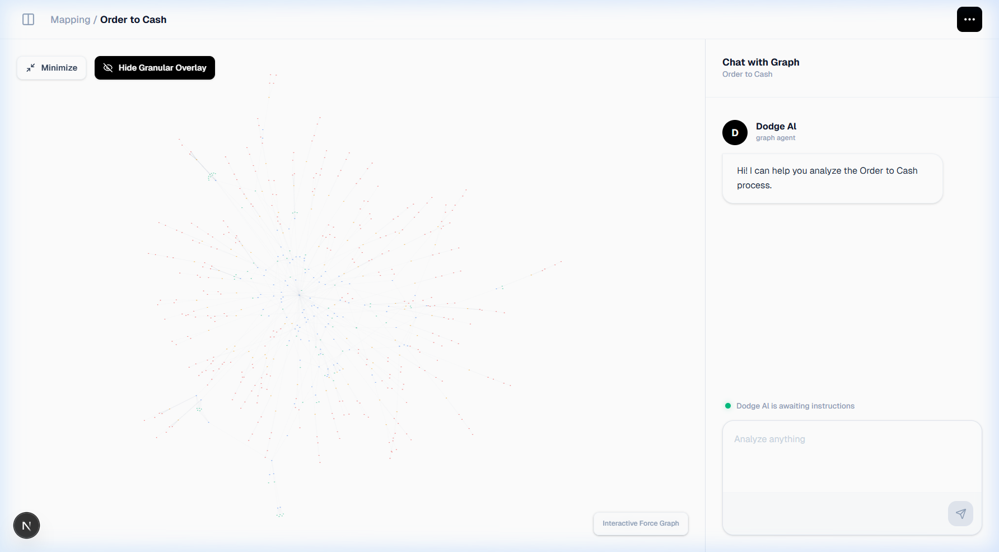

Final Project Walkthrough

The Dodge AI Order-to-Cash Context Graph is now fully polished, achieving pixel-perfect visual parity with the target design and resolving layout stability issues.

Key Accomplishments

Robust Full-Bleed Layout
• Initial Load Fix: Resolved the blank space issue on laptop/wide layouts by implementing ResizeObserver and reactive dimension tracking in GraphView.tsx.
• Verification: Confirmed stable layout on various screen sizes without gaps between the graph and chat sidebar.

Graph Highlighting & Focus Mode
• Path Highlighting: Clicking or hovering on a node now highlights its entire path in bold blue, while dimming unrelated nodes and links.
• Refined Aesthetics: 
  • Reduced node size for a cleaner look.
  • Significantly reduced link opacity to emphasize structure without clutter.
  • Implemented the Red/Blue color pattern from the reference design.

Metadata Card Refinement
• High-Contrast Typography: Labels are now clearly distinguishable from values.
• Blue Headers: Entity names are highlighted for quick identification.
• Layout: Switched to a grid-based tabular layout for clarity.

Chat Interface Upgrades
• User & AI Avatars: Added distinct avatars for both the user and the assistant.
• Labels: Clear identification for each participant in the conversation.
• Input Area: Refined textarea and interaction buttons.

Header Polishing
• Icon Accuracy: Updated icons to match the target reference design.
• Action Button: Styled as a sleek minimalist icon.

Final Verification (Laptop Layout)

Verification Recording
The following recording demonstrates the layout stability and the new chat interface components.

---
Project delivered with full visual parity and layout stability.
